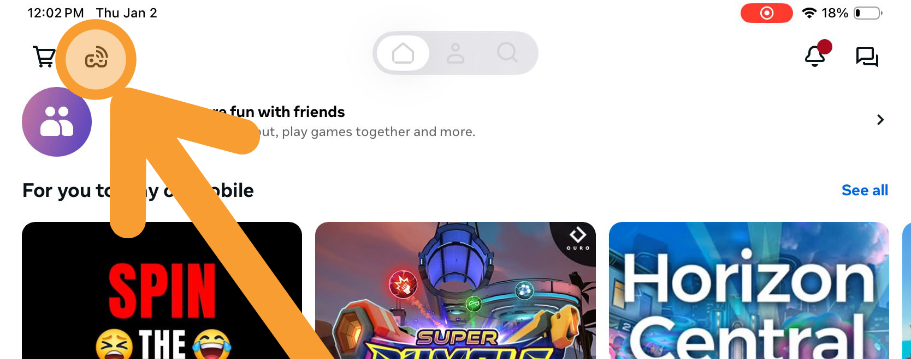
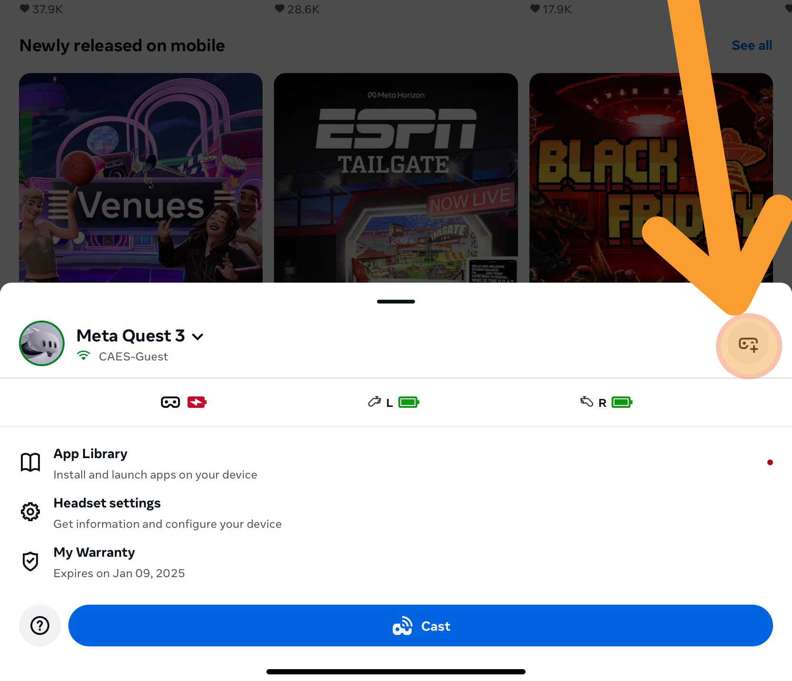
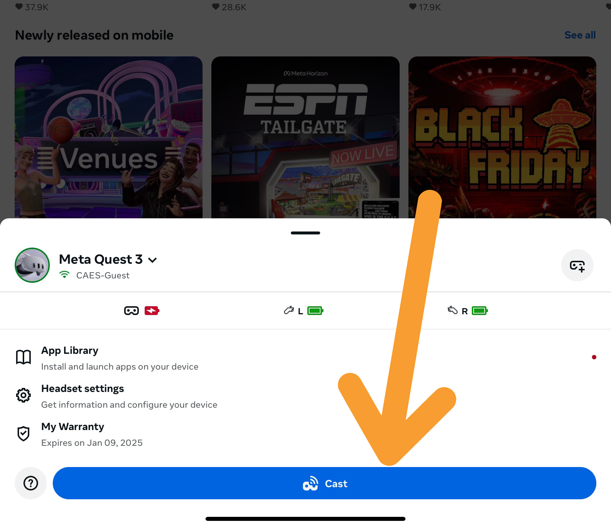

## Casting to an iPad or tablet from Quest 3
### Getting started
1. You need a [Meta account](https://www.meta.com/en-gb/help/quest/articles/accounts/account-settings-and-management/set-up-meta-account-meta-quest/?srsltid=AfmBOoqZS2q2zEv71eLMRYgVBO3ng7Ub-44y8MDSRXThi06au31bEDSe) to connect the headset with a device.
2. Log in to your primary Meta account on [Meta Horizon mobile app](https://www.meta.com/en-gb/help/quest/articles/getting-started/getting-started-with-quest-2/install-meta-horizon-mobile-app/) on the same mobile device you want to cast to.
3. Confirm that your headset and the device that you're casting to are on the same Wi-Fi network.
4. Click on casting.
{ width: 500px; height: auto;}
5. (If you haven't already) Pair headset to app.
{ width: 500px; height: auto;}
6. Click on cast!
{ width: 500px; height: auto;}

### Troubleshooting
* If you are still unable to cast, restart your headset, phone and the device that you're casting to.
* Check for software updates on your devices.
* If you still can't cast, restart your Wi-Fi router.